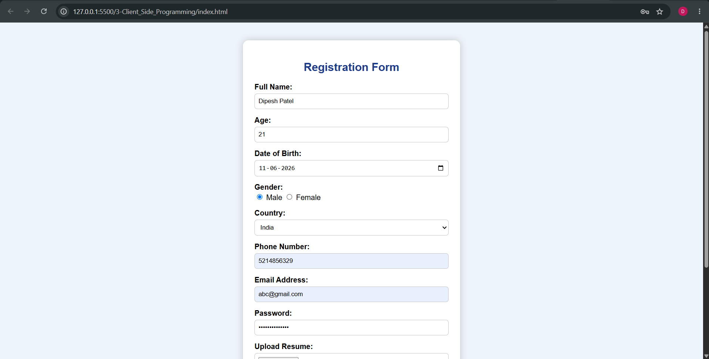
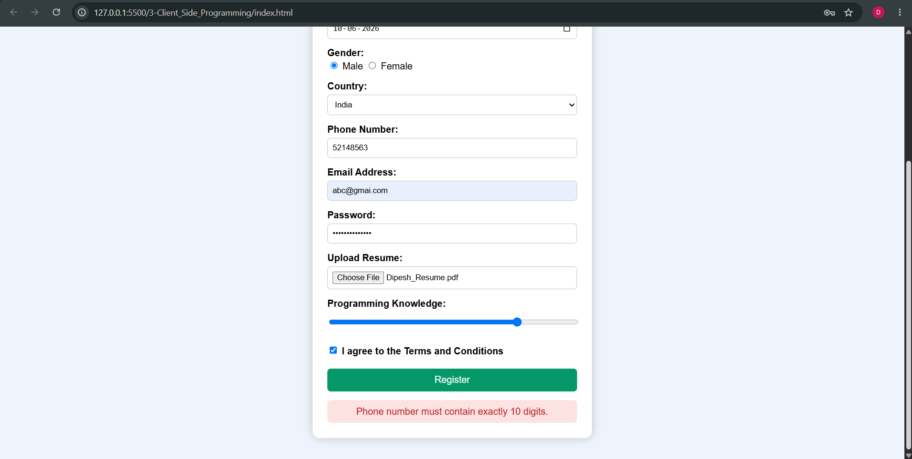
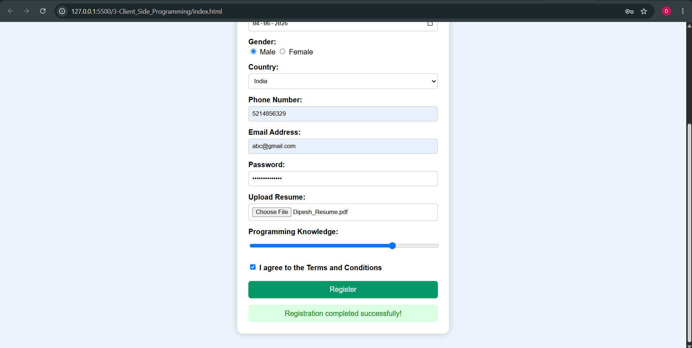

# Client Side Programming

This project demonstrates the use of **HTML**, **CSS**, and **JavaScript** to design and validate a **Student Registration Form**. The application performs client-side validation to ensure that users enter valid information before the form is submitted.

It is developed as part of the **ISS Assignment** for learning the fundamentals of client-side web development.

---

## Features

- Student Registration Form built using HTML and styled with CSS.
- Client-side validation using JavaScript for form inputs and user interaction.
- Validation includes email, password, phone number, required fields, and custom success/error messages.

---

## Registration Form Fields

- Full Name
- Age
- Date of Birth
- Gender
- Country
- Phone Number
- Email Address
- Password
- Upload Resume
- Programming Knowledge (Range Slider)
- Terms and Conditions

---

## Technologies Used

- HTML5
- CSS3
- JavaScript

---

## Project Screenshots

### Registration Form

---

### Validation Error

---

### Successful Form Submission

---

## Learning Outcomes

- Creating forms using HTML
- Styling web pages with CSS
- Using JavaScript for client-side validation
- Working with DOM methods
- Using Regular Expressions for input validation
- Displaying custom success and error messages