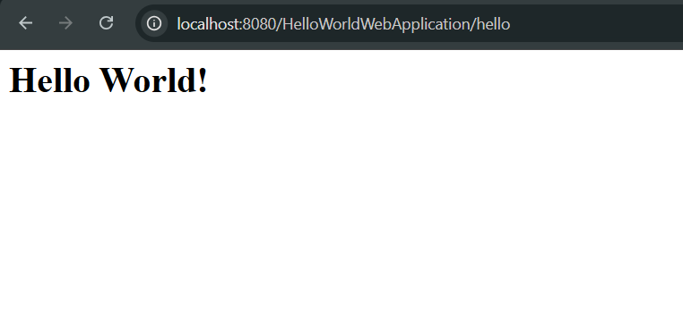

# HelloWorld Web Application

A simple Java web application developed using **Jakarta Servlets**, **JSP**, and **Apache Tomcat**. This project demonstrates the fundamental request-response lifecycle of a Java web application by displaying a **"Hello World!"** message using a servlet.

Unlike the User Authentication project, this application uses the **Deployment Descriptor (`web.xml`)** for servlet configuration instead of annotations, helping understand the traditional approach to servlet mapping.

---

# Features

* Displays a welcome page using JSP.
* Handles HTTP GET requests using a Servlet.
* Uses **`web.xml`** for servlet mapping.
* Demonstrates the Servlet lifecycle.
* Generates dynamic HTML using `PrintWriter`.
* Deployable on Apache Tomcat.

---

# Folder Structure

```text
HelloWorldWebApplication/
│
├── src/
│   ├── main/
│   │   ├── java/
│   │   │   └── com/
│   │   │       └── iss/
│   │   │           └── hello/
│   │   │               └── HelloServlet.java
│   │   │
│   │   └── webapp/
│   │       ├── index.jsp
│   │       ├── META-INF/
│   │       └── WEB-INF/
│   │           └── web.xml
│
├── outputs/
│   ├── Index.png
│   └── HelloWorld.png
│
└── README.md
```

---

# Project Workflow

```text
Browser
    │
    ▼
index.jsp
    │
Click "Hello"
    │
    ▼
GET /hello
    │
    ▼
HelloServlet
    │
    ▼
Generate HTML Response
    │
    ▼
Browser Displays
"Hello World!"
```

---

# How It Works

## 1. Welcome Page (`index.jsp`)

* Acts as the application's landing page.
* Configured as the **welcome file** inside `web.xml`.
* Contains a hyperlink that sends a **GET** request to the servlet.

### Homepage


---

## 2. HelloServlet

`HelloServlet` extends `HttpServlet` and overrides the `doGet()` method.

Responsibilities:

* Receives the HTTP GET request.
* Sets the response content type.
* Generates a simple HTML page.
* Sends the generated HTML back to the browser using `PrintWriter`.

---

## 3. Servlet Mapping (`web.xml`)

Instead of using annotations (`@WebServlet`), this project uses the traditional **Deployment Descriptor**.

```xml
<servlet>

    <servlet-name>HelloServlet</servlet-name>

    <servlet-class>
        com.iss.hello.HelloServlet
    </servlet-class>

</servlet>

<servlet-mapping>

    <servlet-name>HelloServlet</servlet-name>

    <url-pattern>/hello</url-pattern>

</servlet-mapping>
```

Whenever the browser requests

```text
http://localhost:8080/HelloWorldWebApplication/hello
```

Tomcat reads the mapping from `web.xml`, locates `HelloServlet`, and executes its `doGet()` method.

---

## 4. Servlet Response

After processing the request, the servlet generates a simple HTML page containing the **"Hello World!"** message.

### Servlet Output



---

# How to Run

1. Clone this repository.

2. Open the project in **Eclipse IDE**.

3. Configure **Apache Tomcat** as the target runtime.

4. Right-click the project and select:

```text
Run As
    ↓
Run on Server
```

5. Open the application in your browser.

```text
http://localhost:8080/HelloWorldWebApplication/
```

6. Click the **Hello** link to invoke the servlet.

---

# Technologies Used

| Technology          | Purpose                              |
| ------------------- | ------------------------------------ |
| Java                | Core programming language            |
| Jakarta Servlet API | Handling HTTP requests and responses |
| JSP                 | Welcome page (View)                  |
| Apache Tomcat       | Servlet Container                    |
| HTML                | User Interface                       |
| CSS                 | Basic Styling                        |
| Eclipse IDE         | Development Environment              |

---

# Key Concepts Demonstrated

* Dynamic Web Project structure
* HTTP GET request handling
* `HttpServletRequest` and `HttpServletResponse`
* HTML generation using `PrintWriter`
* JSP as the application's entry page
* Servlet mapping using `web.xml`
* Welcome File configuration
* Apache Tomcat deployment

---

# Learning Outcomes

After completing this project, the following concepts are understood:

* Creating a Dynamic Web Project in Eclipse.
* Configuring Apache Tomcat as the server runtime.
* Developing a basic Servlet.
* Creating a JSP welcome page.
* Mapping Servlets using `web.xml`.
* Understanding the request-response lifecycle.
* Deploying and running a Java web application on Apache Tomcat.

> **Note:** This project intentionally uses **`web.xml`-based servlet mapping** to understand the traditional servlet configuration approach. The next project, **User Authentication Web Application**, demonstrates the modern approach using **`@WebServlet` annotations**, along with JDBC integration and session management.
