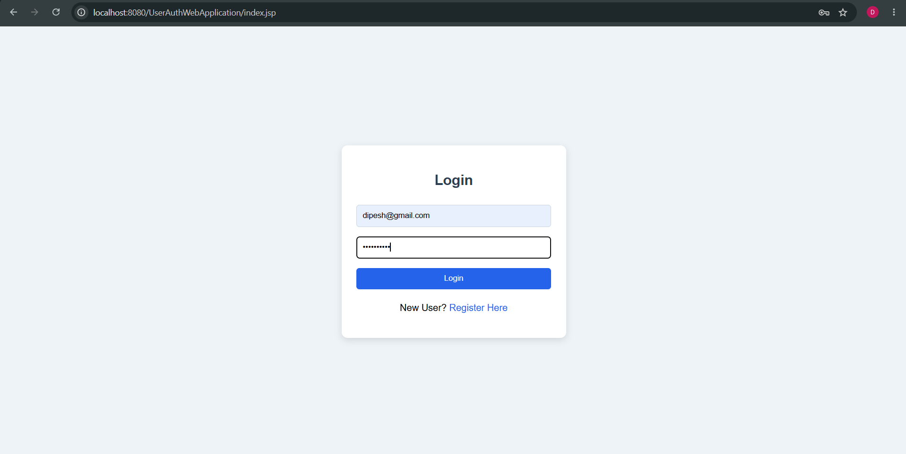
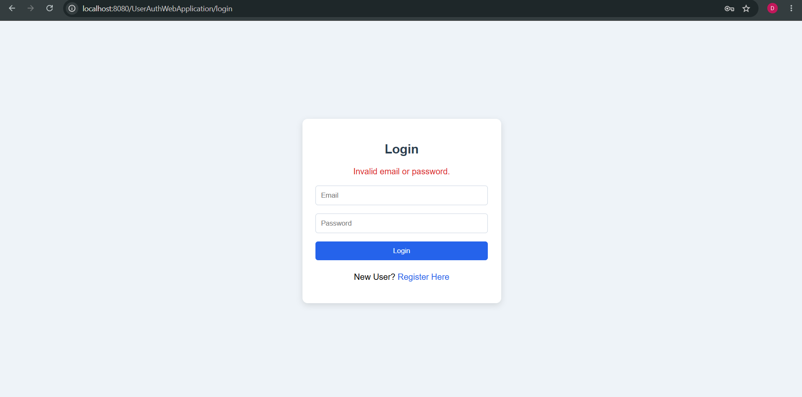
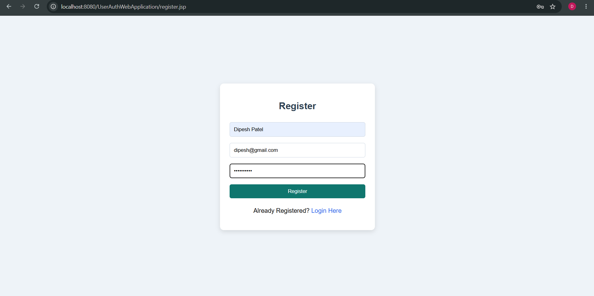
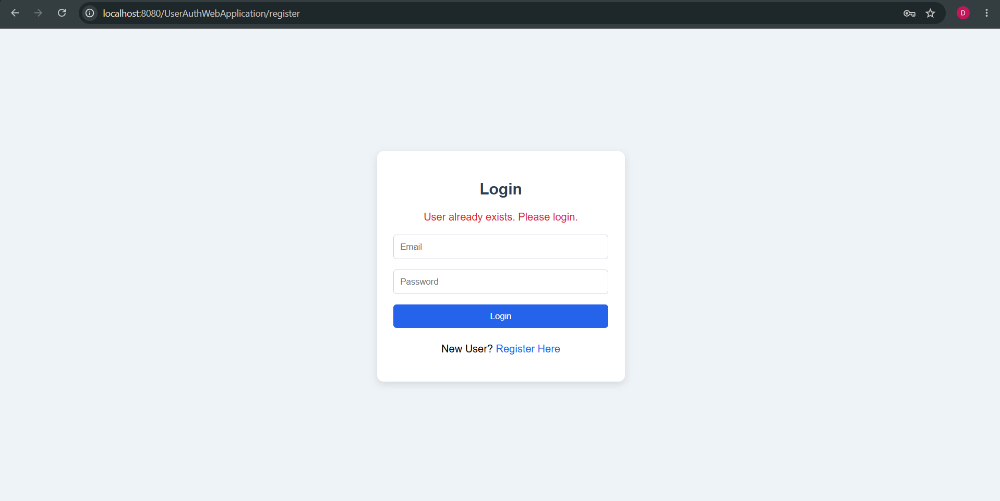
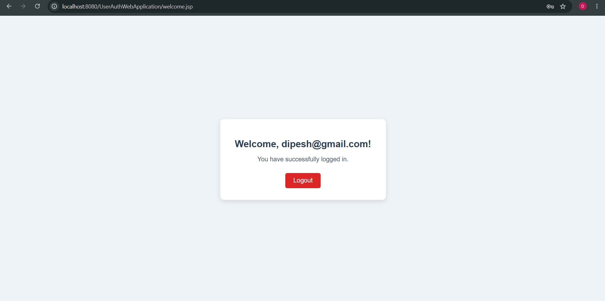

# User Authentication Web Application

A Java web application developed using **Jakarta Servlets**, **JSP**, **JDBC**, **MySQL**, and **Apache Tomcat**. This project demonstrates the implementation of a simple user authentication system featuring user registration, login, logout, session management, client-side validation, and database connectivity.

Unlike the HelloWorld Web Application, this project adopts the **annotation-based servlet mapping (`@WebServlet`)** approach and integrates a MySQL database using JDBC to persist user information.

---

# Features

- User Registration with Name, Email, and Password.
- Login Authentication using Email and Password.
- Session-based User Authentication.
- Logout functionality using Session Invalidation.
- Protected Welcome Page accessible only after successful login.
- Client-side Form Validation using JavaScript.
- JDBC-based MySQL Database Connectivity.
- Annotation-based Servlet Mapping using `@WebServlet`.
- Clean and beginner-friendly User Interface using HTML and CSS.

---


# Folder Structure

```text
UserAuthWebApplication/
│
├── src/
│   └── main/
│       ├── java/
│       │   └── com/
│       │       └── iss/
│       │           └── userauth/
│       │               ├── dao/
│       │               │   └── DBConnection.java
│       │               │
│       │               ├── model/
│       │               │   └── User.java
│       │               │
│       │               ├── servlet/
│       │               │   ├── LoginServlet.java
│       │               │   ├── RegisterServlet.java
│       │               │   └── LogoutServlet.java
│       │               │
│       │               └── util/
│       │
│       └── webapp/
│           ├── js/
│           │   └── validation.js
│           │
│           ├── index.jsp
│           ├── register.jsp
│           ├── welcome.jsp
│           │
│           ├── META-INF/
│           │
│           └── WEB-INF/
│               ├── lib/
│               │   └── mysql-connector-j-9.7.0.jar
│               └── web.xml
│
├── outputs/
│   ├── Login.png
│   ├── LoginInvalid.png
│   ├── Register.png
│   ├── RegisterInvalid.png
│   └── Welcome.png
│
└── README.md
```

---


# Project Workflow

```text
User Opens Application
        │
        ▼
      index.jsp
(Login Page)
        │
        ▼
Enters Email & Password
        │
        ▼
      LoginServlet
        │
        ├───────────────┐
        │               │
 Valid User         Invalid User
        │               │
        ▼               ▼
Create Session    Display Error
        │               │
        ▼               │
  welcome.jsp ◄─────────┘
        │
        ▼
Click Logout
        │
        ▼
 LogoutServlet
        │
        ▼
Session Invalidated
        │
        ▼
Redirect to index.jsp
```

---

# How It Works

## 1. User Registration

The registration form is provided by **register.jsp**.

When the user submits the form:

- Client-side validation is performed using `validation.js`.
- The form sends a **POST** request to `RegisterServlet`.
- `RegisterServlet` checks whether the email already exists in the database.
- If the email is unique, the user details are inserted into the `users` table.
- After successful registration, the user is redirected to the login page.

---

## 2. User Login

The login page is implemented in **index.jsp**.

When the user enters valid credentials:

- The form sends a **POST** request to `LoginServlet`.
- The servlet verifies the credentials using JDBC.
- If authentication succeeds, a new HTTP Session is created.
- The user's email is stored in the session.
- The user is redirected to `welcome.jsp`.

If the credentials are invalid, an error message is displayed on the login page.

---

## 3. Protected Welcome Page

`welcome.jsp` is accessible only after successful authentication.

Before displaying the page, it checks whether a valid session exists.

If no authenticated user is found:

- The user is automatically redirected to `index.jsp`.

Otherwise, the page displays a personalized welcome message and provides a Logout option.

---

## 4. Logout

When the Logout button is clicked:

- A request is sent to `LogoutServlet`.
- The current session is invalidated.
- All session data is removed.
- The user is redirected back to the login page.

---


# Application Screenshots

## Login Page

The application starts with a simple login page where existing users can enter their email address and password.



---

## Login Validation

If invalid credentials are entered, an appropriate error message is displayed without granting access to the protected pages.



---

## Registration Page

New users can create an account by providing their name, email address, and password.



---

## Registration Validation

Client-side JavaScript validation ensures that all required fields are completed before the form is submitted to the server.



---

## Welcome Page

After successful authentication, the user is redirected to a protected welcome page. The page greets the logged-in user and provides a Logout option.



---


# Database Configuration

This application uses **MySQL** as the backend database to store user information.

## Database Schema

```sql
-- Create the database
CREATE DATABASE core_java_db;

-- Select the database
USE core_java_db;

-- Create the users table
CREATE TABLE users (
    id INT AUTO_INCREMENT PRIMARY KEY,
    name VARCHAR(100) NOT NULL,
    email VARCHAR(100) NOT NULL UNIQUE,
    password VARCHAR(100) NOT NULL
);

-- Display the table structure
DESC users;
```

---

## Database Connection

The database connection is managed by the **`DBConnection.java`** class.

It is responsible for:

- Loading the MySQL JDBC Driver.
- Establishing a connection with the MySQL database.
- Returning a `Connection` object to the servlets.

The application communicates with the database using **JDBC** and **PreparedStatement** to execute SQL queries securely.

---

## User Authentication Process

### Registration

- Checks whether the email already exists.
- Inserts a new user into the `users` table.
- Redirects the user to the Login page after successful registration.

### Login

- Validates the email and password against the database.
- Creates a new HTTP Session upon successful authentication.
- Redirects the user to the Welcome page.

### Logout

- Invalidates the current session.
- Redirects the user back to the Login page.

---

# How to Run

## 1. Clone the Repository

Clone the repository and navigate to the project directory.

```bash
git clone <repository-url>
```

---

## 2. Open the Project

Open the project using **Eclipse IDE**.

Ensure that:

- JDK is configured.
- Apache Tomcat is added as the Target Runtime.

---

## 3. Configure MySQL

Start the MySQL Server and execute the SQL script to create:

- `core_java_db`
- `users` table

Update the database credentials inside:

```text
DBConnection.java
```

Example:

```java
private static final String URL = "jdbc:mysql://localhost:3306/core_java_db";
private static final String USER = "root";
private static final String PASSWORD = "your_password";
```

---

## 4. Add MySQL JDBC Driver

Copy the MySQL Connector/J JAR into:

```text
src/main/webapp/WEB-INF/lib/
```

Also add the JAR to the project's **Java Build Path** in Eclipse.

---

## 5. Configure Apache Tomcat

1. Add Apache Tomcat as the Target Runtime.
2. Right-click the project.
3. Select:

```text
Run As
    ↓
Run on Server
```

4. Choose the configured Tomcat Server.

---

## 6. Launch the Application

Open your browser and visit:

```text
http://localhost:8080/UserAuthWebApplication/
```

---

## Test the Application

### Registration

- Register a new user.
- Verify that the record is inserted into the database.

### Login

- Login using the registered credentials.
- Verify that the Welcome page is displayed.

### Logout

- Click **Logout**.
- Verify that the session is destroyed.
- Attempting to access `welcome.jsp` directly should redirect back to the Login page.

---


# Technologies Used

| Technology | Purpose |
|------------|---------|
| Java | Core programming language |
| Jakarta Servlet API | Handling HTTP requests and responses |
| JSP | Building dynamic web pages |
| JDBC | Connecting Java applications to MySQL |
| MySQL | Storing user information |
| Apache Tomcat | Servlet Container |
| HTML | Page Structure |
| CSS | User Interface Styling |
| JavaScript | Client-side Form Validation |
| Eclipse IDE | Development Environment |

---

# Key Concepts Demonstrated

- Dynamic Web Project Structure
- MVC (Model-View-Controller) Architecture
- Servlet Lifecycle (`init()`, `doPost()`, `destroy()`)
- Annotation-based Servlet Mapping using `@WebServlet`
- HTTP POST Request Handling
- JSP and Servlet Integration
- Client-side Validation using JavaScript
- JDBC Database Connectivity
- SQL using `PreparedStatement`
- User Registration and Login
- HTTP Session Management
- Session-based Page Protection
- Logout using Session Invalidation
- Request Forwarding and Response Redirection
- Error Handling and Validation

---

# Learning Outcomes

After completing this project, the following concepts were understood:

- Creating a complete Java Web Application using Servlets and JSP.
- Processing HTML forms using Servlets.
- Connecting Java applications with MySQL using JDBC.
- Implementing user authentication and authorization.
- Managing user sessions using `HttpSession`.
- Protecting pages from unauthorized access.
- Performing client-side validation using JavaScript.
- Using `PreparedStatement` to execute SQL queries securely.
- Organizing a Dynamic Web Project using packages such as `model`, `dao`, and `servlet`.
- Deploying and running Java Web Applications on Apache Tomcat.

---

# Future Improvements

Some possible enhancements that can be added to this project include:

- Password Encryption using BCrypt.
- Forgot Password functionality.
- Email Verification during registration.
- Remember Me functionality using Cookies.
- User Profile Management.
- Input validation using Regular Expressions on the server side.
- Role-based Authentication (Admin/User).
- Migration to Maven for dependency management.
- Adoption of the DAO Design Pattern with separate CRUD methods.
- Migration to Spring Boot and Spring Security for enterprise-level development.

---

> **Note:** This project was developed as a learning exercise to understand the fundamentals of Java Web Development using Servlets, JSP, JDBC, MySQL, and Apache Tomcat. It focuses on core concepts such as request-response processing, session management, servlet lifecycle, and database connectivity, providing a strong foundation for building more advanced Java web applications.


